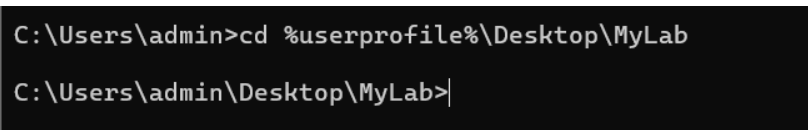
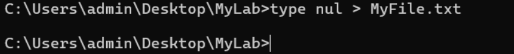
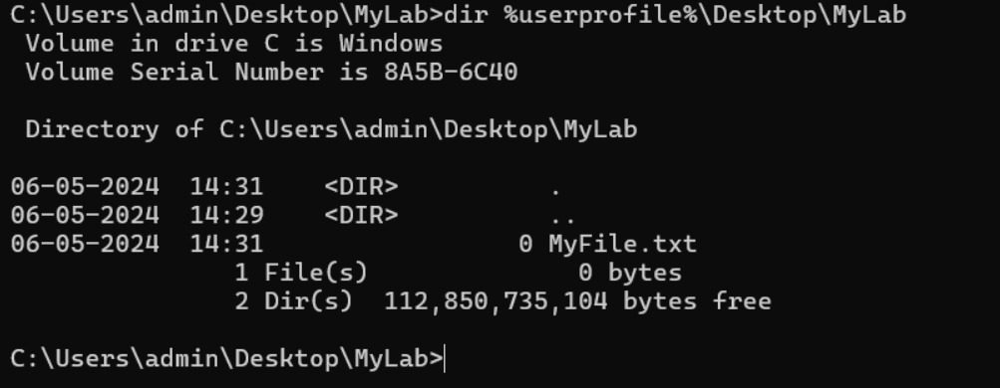
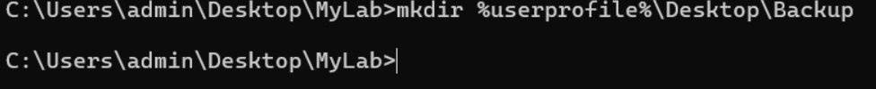
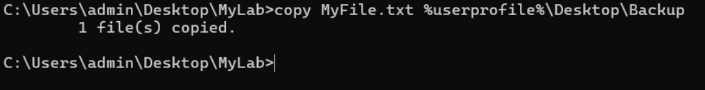
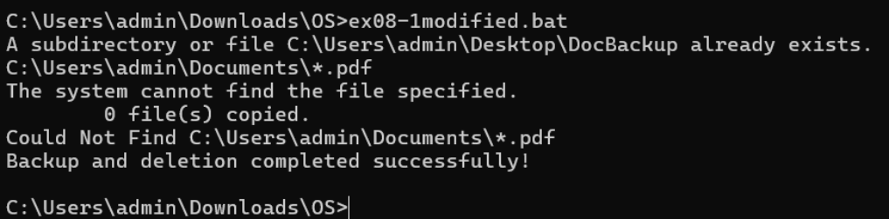
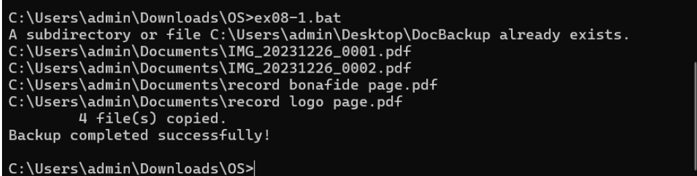
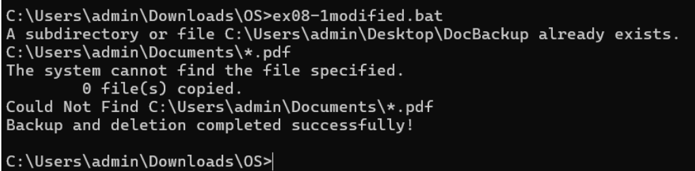

# Windows-basic-commands-batchscript
Ex08-Windows-basic-commands-batchscript

# AIM:
To execute Windows basic commands and batch scripting

# DESIGN STEPS:

### Step 1:

Navigate to any Windows environment installed on the system or installed inside a virtual environment like virtual box/vmware 

### Step 2:

Write the Windows commands / batch file . Save each script in a file with a .bat extension. Ensure you have the necessary permissions to perform the operations. Adapt paths as needed based on your system configuration.
### Step 3:

Execute the necessary commands/batch file for the desired output. 


# WINDOWS COMMANDS:
## Exercise 1: Basic Directory and File Operations
Create a directory named "my-folder"

## COMMAND AND OUTPUT

```
mkdir %userprofile%\Desktop\MyLab
```


Change to the "MyLab" directory and create an empty text file named "MyFile.txt" inside it.

## COMMAND AND OUTPUT
```
cd %userprofile%\Desktop\MyLab
```



type nul > MyFile.txt



List the contents of the "MyLab" directory.

## COMMAND AND OUTPUT
```
dir %userprofile%\Desktop\MyLab
```


Copy "MyFile.txt" to a new folder named "Backup" on the desktop.

## COMMAND AND OUTPUT
```
mkdir %userprofile%\Desktop\Backup
```


copy MyFile.txt %userprofile%\Desktop\Backup



Move the "MyLab" directory to the "Documents" folder.


## COMMAND AND OUTPUT
```
mkdir %userprofile%\Desktop\Documents
```
move MyLab Documents



## Exercise 2: Advanced Batch Scripting
Create a batch file named on the desktop. The batch file need to have a variable assigned with a desired name for ex. name="John" and display as "Hello, John".
## command
```
@echo off
mkdir %userprofile%\Desktop\DocBackup
copy %userprofile%\Documents\*.docx %userprofile%\Desktop\DocBackup
echo Backup completed successfully!
```

## OUTPUT



## command
```
  @echo off
  mkdir %userprofile%\Desktop\DocBackup
  copy %userprofile%\Documents\*.docx %userprofile%\Desktop\DocBackup
  del %userprofile%\Documents\*.docx
  echo Backup and deletion completed successfully!
```

## OUTPUT





# RESULT:
The commands/batch files are executed successfully.

